# Prompt Search Engine (ft. LEAF)

**A production-style semantic search engine that finds the right AI prompt from a 20,000-prompt catalogue using natural language.**

Keyword search breaks down the moment two people describe the same idea with different words. This project solves that with a full retrieval stack: dense embeddings, a vector index, lexical fallback, neural reranking, metadata-aware ranking, and an optional agentic query-rewriting layer — wrapped in an interactive demo and validated with a real evaluation harness.

Built as an industry-partner project with **LEAF**, who provided the PromptKaban dataset, during the AI Techniques course at **LUISS**.

<p>
  
  
  
  
  
  
</p>

---

## Table of contents

- [What it does](#what-it-does)
- [The data](#the-data)
- [Highlights](#highlights)
- [How it works](#how-it-works)
- [Results](#results)
- [Tech stack](#tech-stack)
- [Demo and design](#demo-and-design)
- [Project structure](#project-structure)
- [Getting started](#getting-started)
- [Team and contributions](#team-and-contributions)
- [Dataset and acknowledgements](#dataset-and-acknowledgements)
- [License](#license)

---

## What it does

Given a natural-language query such as *"write a professional cold email to a potential B2B client"*, the engine returns the most relevant prompts from a catalogue of **~20,000 records**, each with **20 metadata fields** (engagement, author reputation, difficulty, language, target model, and more).

The system understands *intent*, not just keywords: it combines the meaning of the query (embeddings) with exact-term matching (BM25), reorders candidates with a cross-encoder, and finally blends in real-world signals like popularity, quality, and freshness to surface prompts a person would actually want to use.

**Example — top results table generated by the pipeline:**

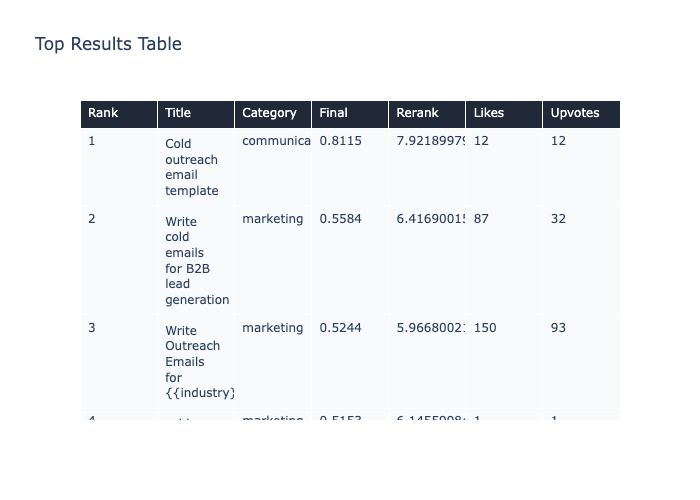

**Example — score breakdown for a single result (semantic vs. popularity vs. quality vs. freshness):**

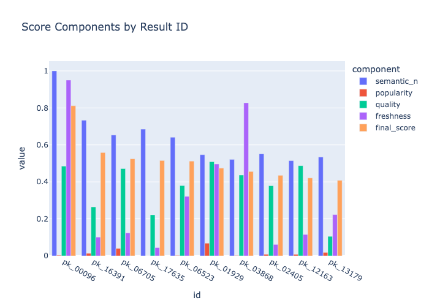

---

## The data

The **PromptKaban** dataset was provided by LEAF and contains **20,000 prompts** spanning categories such as marketing, coding, creative writing, and data analysis. Each record carries **20 fields** — the prompt `title` and `content`, taxonomy (`category`, `subcategory`, `tags`), engagement signals (`likes`, `upvotes`, `downvotes`, `views`, `uses`), quality signals (`author_reputation`, `fork_count`, `version`), and context such as `created_at`, `difficulty`, `language`, and `target_model`. The data arrived as clean, structured JSON, so no data cleaning was needed and the effort went into exploration and feature engineering instead.

Exploratory data analysis directly shaped the ranking design. A few key findings:

- The catalogue is **dominated by a handful of business and communication categories**, with a long tail of specialised topics — which is why the engine uses *intent-adaptive* metadata weights rather than one fixed recipe.
- Most prompts are **short** (under ~200 characters), with a secondary cluster around 300–400 and a few long outliers — motivating a 700-character cap on the composite `semantic_text` field.
- The engagement fields (likes, upvotes, downvotes, views, uses) are **strongly correlated** (≈0.70–0.85), so they collapse into a single popularity score, while author reputation contributes a separate quality signal.
- The corpus is **predominantly English**, with a small multilingual tail (it, es, fr, de, pt, zh, ja).

| | |
|---|---|
| 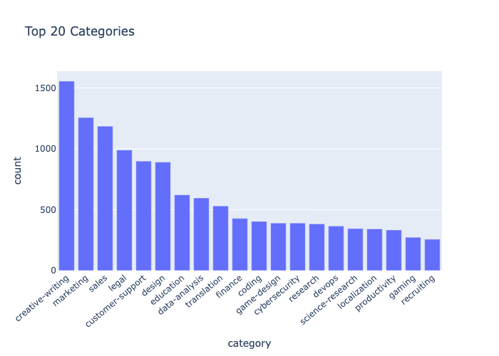 | 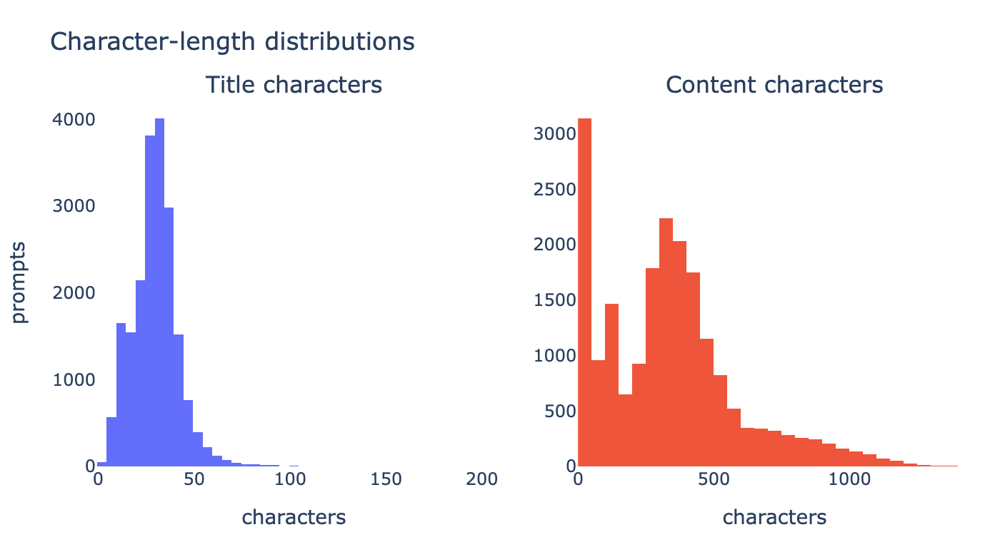 |
| **Top categories by prompt count** — creative writing leads, followed by marketing, sales, and legal; a long tail of niche topics motivates intent-adaptive weighting. | **Title & content length distributions** — titles stay under ~50 characters; content peaks around 100–400 with a long tail, motivating the 700-character `semantic_text` cap. |
| 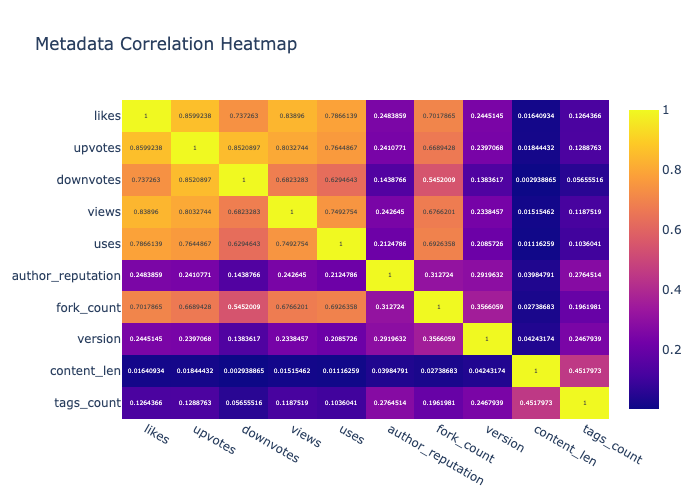 | 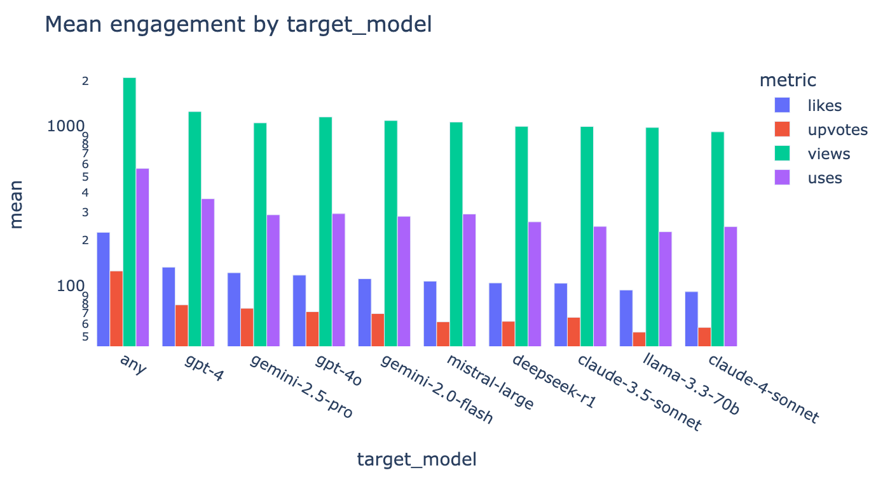 |
| **Metadata correlation heatmap** — engagement fields move together (≈0.6–0.9) and merge into one popularity signal, while author reputation stays separate as a quality signal. | **Mean engagement by target model** — `any`-model prompts collect ~2× the engagement of model-specific ones (note the log scale). |
| 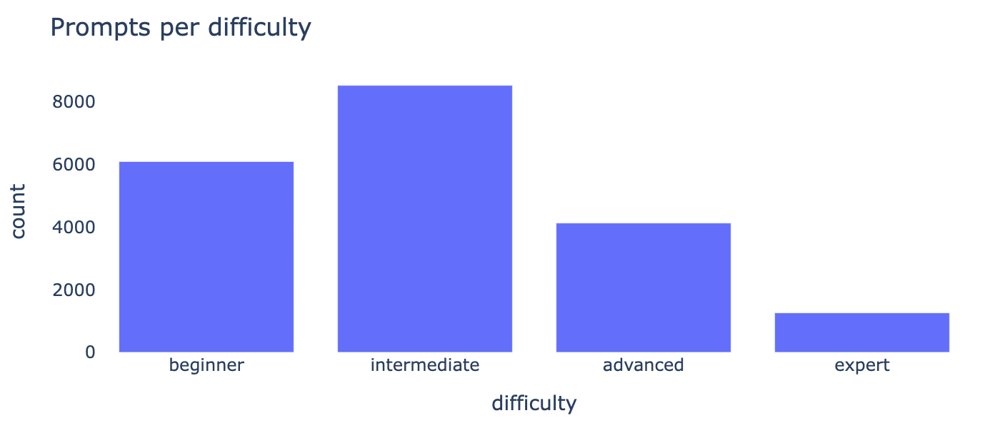 |  |
| **Difficulty mix** — the corpus skews toward *intermediate*, with *expert* a small tail; difficulty is used as a soft compatibility signal, not a hard filter. | **Language distribution** — overwhelmingly English with a small multilingual tail, which is why an English-tuned embedder is a good fit. |

See `LEAF-promptkaban-dataset/FIELDS.md` for the full field schema.

---

## Highlights

- **Hybrid retrieval** — dense cosine search (FAISS `IndexFlatIP` over sentence-transformer embeddings) fused with lexical BM25, so the engine captures meaning *and* exact keywords.
- **Neural reranking** — a cross-encoder (`ms-marco-MiniLM-L-6-v2`) re-reads each (query, candidate) pair for a sharper relevance score.
- **Metadata-aware ranking** — final score blends semantic relevance with a popularity signal, a quality proxy (author reputation, forks, versions), and an exponential **freshness decay (180-day half-life)**.
- **Intent-adaptive weighting** — detects query intent (coding, marketing, data-analysis, creative writing) and tunes the ranking weights accordingly.
- **Agentic query rewriting** — an LLM (Ollama → Hugging Face `flan-t5` → heuristic fallback) generates paraphrases that are fused with **Reciprocal Rank Fusion** to boost recall on vague queries.
- **Diversity control** — **MMR** post-processing removes near-duplicate results.
- **Rigorous evaluation** — a 200-query silver benchmark, a 200-result human audit across 20 queries, an embedding-model bake-off, and a small reranker fine-tune experiment.
- **Interactive demo** — a Streamlit app and an in-notebook widget UI for live querying.
- **Runs on a laptop** — defensive engineering: device auto-detection (CUDA / Apple MPS / CPU), on-disk embedding caches, and graceful fallbacks (sklearn vector search, heuristic rewriter) when heavy models are unavailable.

---

## How it works

```text
            Natural-language query
                     │
        ┌────────────┴─────────────┐
        │   (agentic) query rewrite │   LLM paraphrases + RRF fusion
        └────────────┬─────────────┘
                     ▼
         Hybrid retrieval (dense + BM25)        →  top candidates
                     ▼
        Cross-encoder reranking                 →  sharper relevance
                     ▼
        Metadata-aware scoring                  →  + popularity / quality / freshness
        (intent-adaptive weights)
                     ▼
        MMR diversification                     →  ranked, de-duplicated results
```

Each stage lives in its own module under `src/`, ordered by role in the pipeline:

| Stage | Module | Responsibility |
|---:|---|---|
| 1 | `01_preprocessing.py` | Load and validate the dataset, engineer features, build the composite `semantic_text` field, tokenize for BM25. |
| 2 | `02_embeddings.py` | Encode prompts with sentence-transformers, cache vectors, build the FAISS index (sklearn fallback), benchmark candidate embedding models. |
| 3 | `03_retrieval.py` | Dense cosine retrieval, BM25 lexical retrieval, and weighted hybrid fusion. |
| 4 | `04_reranking.py` | Cross-encoder reranking, metadata scoring, intent detection, MMR. |
| 5 | `05_pipeline.py` | End-to-end `search_pipeline()` orchestration and the interactive demo UI. |
| 6 | `06_query_rewriter.py` | Agentic layer: query rewriting, multi-query retrieval, Reciprocal Rank Fusion. |
| 7 | `07_evaluation.py` | Metrics, model comparison, strict/silver benchmarks, human-audit summaries, fine-tune report. |

`src/search_runtime.py` packages the whole stack into a clean, importable runtime, and `src/app.py` is the Streamlit demo built on top of it.

**Semantic map — PCA projection of prompt embeddings (the structure the engine searches over):**

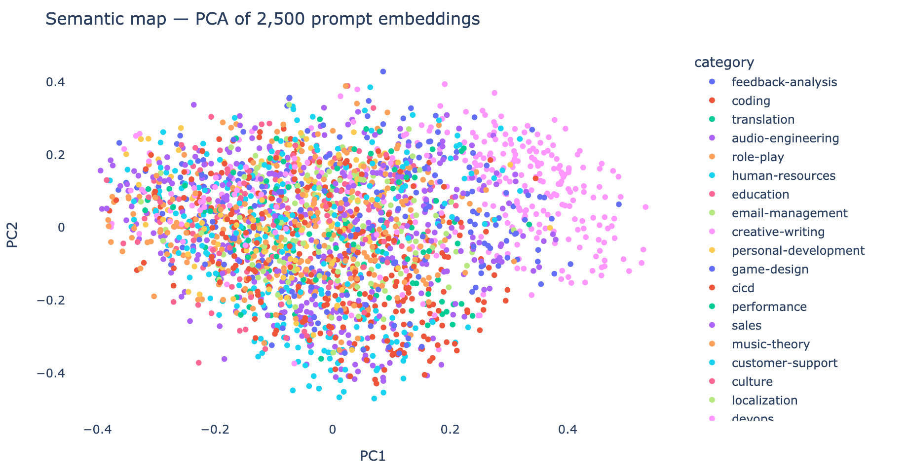

---

## Results

Automatic and human metrics are reported separately because they measure different things: the silver benchmark measures retrieval coverage at scale, while the human audit measures perceived usefulness.

### 200-query silver benchmark

| Pipeline | Mean P@10 | P@10 (strict) | MRR | nDCG@10 | Avg latency |
|---|---:|---:|---:|---:|---:|
| **Agentic full** | **0.797** | **0.612** | 0.887 | **0.667** | ~9.4 s |
| Agentic (no rerank) | 0.706 | 0.275 | **0.941** | 0.443 | ~4.2 s |
| Baseline | 0.610 | 0.343 | 0.779 | 0.431 | ~4.7 s |

The full agentic pipeline wins on overall retrieval quality; the no-rerank variant trades quality for the best MRR and lower latency.

### Human audit (200 results across 20 queries)

| Relevance rule | Human Precision@10 |
|---|---:|
| Partial or full relevance (`grade ≥ 1`) | 0.645 |
| Full relevance only (`grade == 2`) | 0.355 |

### Reranker fine-tune experiment

| Stage | Holdout RMSE |
|---|---:|
| Before fine-tune | 0.481 |
| After fine-tune | 0.449 |

**Embedding-model bake-off (MiniLM vs. BGE-small vs. E5-small):**

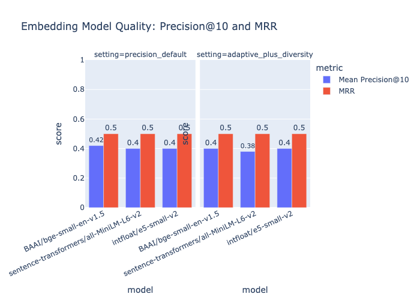

**Pipeline quality under the strict benchmark:**


---

## Tech stack

**Language:** Python 3.12

**ML / NLP:** PyTorch, sentence-transformers (bi-encoders + cross-encoder), Hugging Face Transformers, FAISS, rank-bm25, scikit-learn

**Data & viz:** pandas, NumPy, Plotly

**App & tooling:** Streamlit, Jupyter, ipywidgets

**Techniques:** dense retrieval, hybrid search, cross-encoder reranking, Reciprocal Rank Fusion, MMR, intent classification, query rewriting (RAG-style), offline evaluation (P@k, MRR, nDCG).

---

## Demo and design

The engine ships with a working **Streamlit app** for live querying and a polished **Figma prototype** that shows how the search would feel inside PromptKaban. The product concept and the entire interface design were created by **Alisa Lamina**.

### Streamlit demo

A real, runnable app on top of the importable search runtime. Type a query, pick a pipeline (Baseline / Agentic no-rerank / Agentic full), and inspect the ranked results with their score breakdowns.

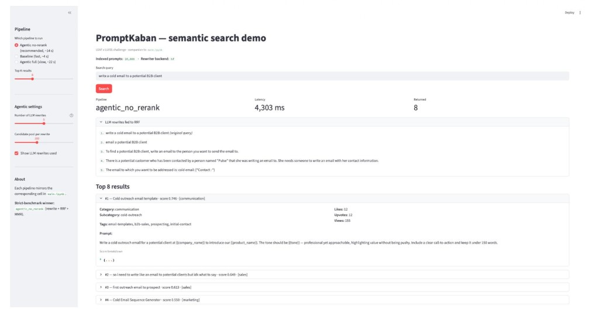

*The Streamlit demo running "write a cold email to a potential B2B client" through the agentic no-rerank pipeline. The sidebar selects the pipeline and parameters (e.g. number of rewrites); the main panel reports the end-to-end latency (4,303 ms in this run), the query paraphrases sent to Reciprocal Rank Fusion, and the top results with their scores and metadata.*

### Figma prototype

A higher-fidelity product vision for how semantic search would live inside PromptKaban, with a pipeline selector and a live, per-stage breakdown of the retrieval flow. The interactive version is available at **[floret-cage-69166833.figma.site](https://floret-cage-69166833.figma.site)**.

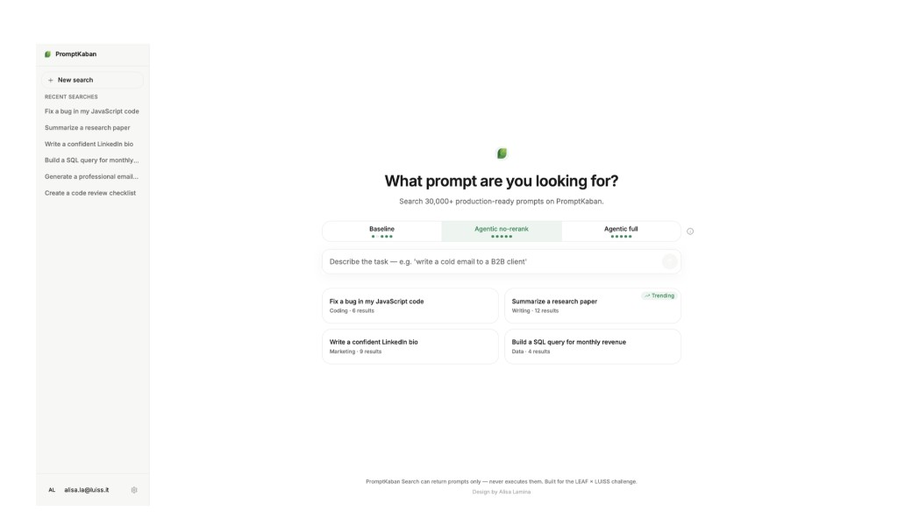

*Main search interface — a single search box and three pipeline options: Baseline (fast), Agentic no-rerank (recommended), and Agentic full (slow). The sidebar shows recent searches and the main area surfaces trending queries. (Latencies in the prototype are illustrative; measured values are in the [Results](#results) table.)*

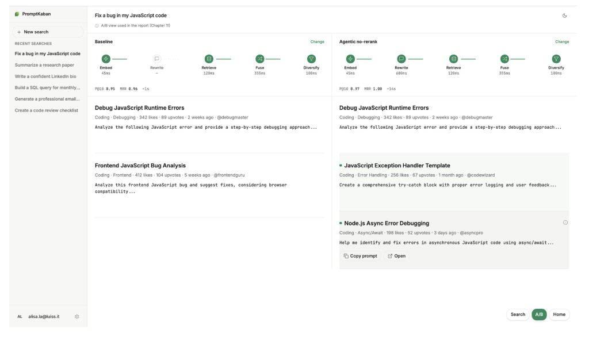

*A/B view for "Fix a bug in my JavaScript code" — each side shows a pipeline breakdown by stage (Embed → Rewrite → Retrieve → Fuse → Diversify) with its P@10 and MRR. The agentic side adds a Rewrite step and surfaces extra relevant results the baseline misses (highlighted in green).*

---

## Project structure

```text
prompt-search-engine/
├── README.md
├── requirements.txt
├── LICENSE
├── main.ipynb                  # end-to-end research notebook (recommended entry point)
├── LEAF-promptkaban-dataset/   # dataset + field schema
│   ├── dataset.json
│   └── FIELDS.md
├── src/
│   ├── 01_preprocessing.py
│   ├── 02_embeddings.py
│   ├── 03_retrieval.py
│   ├── 04_reranking.py
│   ├── 05_pipeline.py
│   ├── 06_query_rewriter.py
│   ├── 07_evaluation.py
│   ├── search_runtime.py       # importable runtime used by the demo
│   └── app.py                  # Streamlit demo
├── assets/                     # exported figures
└── results/                    # human-audit labels and queries
```

---

## Getting started

```bash
# 1. Install dependencies (Python 3.12 recommended)
pip install -r requirements.txt
```

**Option A — the notebook (recommended).** It runs the full pipeline end to end with explanations, tables, and plots:

```bash
jupyter notebook main.ipynb
```

**Option B — the live Streamlit demo.** Type a query, pick a pipeline, and inspect ranked results with score breakdowns:

```bash
cd src
streamlit run app.py
```

> First run downloads the embedding and reranker models and builds the vector index (a few minutes). Embeddings are then cached to disk, so later runs are much faster. The notebook scripts in `src/` are organized by pipeline stage and mirror the notebook chapter by chapter.

---

## Team and contributions

This was a four-person team project. 

The table below reproduces the author-contribution breakdown from our technical report, following the [CRediT](https://credit.niso.org/) taxonomy.

| Contribution | Alisa Lamina | Maiia Kopalina | Alice Rossi | Andrea Cipolla |
|---|:---:|:---:|:---:|:---:|
| Conceptualization | ✓ | | | |
| Project administration | ✓ | | | |
| Methodology | ✓ | ✓ | ✓ | ✓ |
| Software | ✓ | ✓ | ✓ | ✓ |
| Visualization | ✓ | | ✓ | |
| Formal analysis | ✓ | ✓ | ✓ | ✓ |
| Validation | | ✓ | ✓ | ✓ |
| Writing — original draft | | ✓ | | ✓ |
| Writing — review & editing | ✓ | ✓ | ✓ | ✓ |

---

## Dataset and acknowledgements

The **PromptKaban** dataset (~20,000 prompt records, 20 metadata fields) was provided by **LEAF** as the industry partner for the AI Techniques course at **LUISS**. See `LEAF-promptkaban-dataset/FIELDS.md` for the full field schema.

---

## License

Released under the [MIT License](LICENSE). The dataset remains the property of its original provider (LEAF) and is included here for demonstration and educational purposes.
